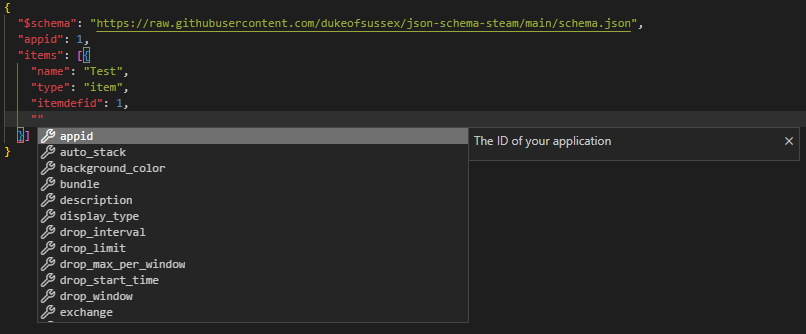

# JSON Schema Steam

[](https://github.com/dukeofsussex/json-schema-steam/blob/master/LICENSE)

JSON Schema for the [Steam Inventory](https://partner.steamgames.com/doc/features/inventory/schema).

## Installation

Simply add the `$schema` to your json file containing your inventory schema and enjoy the benefits of auto-completion and validation from within your favourite (supported) editor.

```json
{
  "$schema": "https://raw.githubusercontent.com/dukeofsussex/json-schema-steam/main/schema.json",
  "appid": ...,
  "items": [{
    ...
  }]
}
```



## Contributing

Any contributions made are welcome and greatly appreciated.

1. Fork the project
2. Create your feature branch (`git checkout -b feature`)
3. Code it
4. Commit your changes (`git commit -m 'Add something awesome'`)
5. Push to the branch (`git push origin feature`)
6. Open a Pull Request

## License

This project is licensed under the GNU GPL License. See the [LICENSE](LICENSE) file for details.
